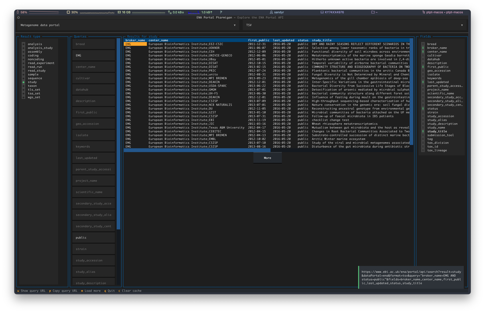

# ENA PorTal PTarmigan ("ptpt")

A Textual User Interface for the [ENA Portal API](https://www.ebi.ac.uk/ena/portal/api/).

This TUI app makes it easier to build ENA Portal API Queries, by loading the available result types, search fields, and return fields into an interface.

## Install
1. Download the appropriate binary (MacOS or Linux) from [releases](https://github.com/SandyRogers/ena-portal-ptarmigan/releases)
2. `mv ptpt-* ptpt` 
3. `chmod +x ptpt`

## Run it
`./ptpt`

## Dev setup
1. Install [Poetry](https://python-poetry.org)
2. `poetry self add poetry-pyinstaller-plugin`
3. `poetry install`

### What is a Ptarmigan?
[Let me google that for you](https://www.rspb.org.uk/birds-and-wildlife/ptarmigan)